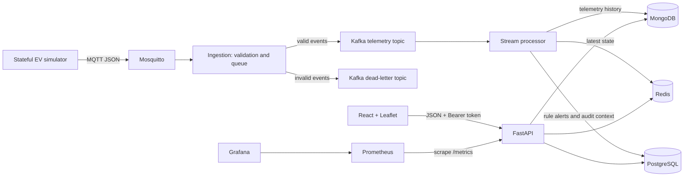

# EV Fleet Intelligence

An independent hackathon prototype for fleet operators that combines synthetic EV telemetry, live fleet visibility, battery and range indicators, charging recommendations, and operational alerts. The application uses synthetic data only and is not affiliated with Motorq.

## Problem being addressed

Fleet operators need a timely view of vehicle location, battery state, likely remaining range, charging needs, and fleet-level risks. This prototype demonstrates an event-driven path from vehicle telemetry to operational dashboard data, plus bounded historical consumption analysis. It is a local demonstrator, not a production fleet-management system.

## Features

- PostgreSQL registry seeded with 100,000 synthetic vehicles, fleet membership, roles, charging stations, and connectors.
- Stateful configurable simulator; the Compose default runs 1,000 simulator vehicles at a target base rate of 20 generation ticks per second. Simulator count and event rate can be changed; neither the seeded registry size nor the configured target rate is a throughput benchmark.
- MQTT telemetry intake, schema validation, Kafka topics, dead-letter handling, stream processing, MongoDB history, Redis latest vehicle state, and PostgreSQL alerts/audit.
- Authenticated React dashboard with fleet metrics, live map, latest vehicle list, selected-vehicle battery/range insights, charging recommendations, open alerts, historical consumption, station inventory, and service readiness.
- FastAPI bearer-token authentication, PBKDF2 password hashes, database-backed active membership/role checks, per-IP Redis rate limits, and audited alert status transitions.
- Prometheus API request/latency metrics and a Grafana service.

The telemetry is synthetic. Battery health is based on transparent rules and recent observations; there is no trained machine-learning model. Range is an energy-balance baseline. Charging recommendations are a deterministic heuristic over seeded station data.

## Architecture and data flow



1. The simulator emits versioned telemetry to `evfleet/telemetry/v1/{vehicle_id}` on MQTT. Simulator state restores its latest values and per-vehicle sequence numbers from Redis after restart.
2. Ingestion validates canonical event fields, uses bounded worker queues, and publishes valid events to partitioned Kafka telemetry. Invalid records are routed to a dead-letter topic; delivery/backpressure behavior is logged.
3. The stream processor consumes Kafka events, deduplicates and rejects stale state progression, stores telemetry history in MongoDB, advances latest vehicle state in Redis, and evaluates rule-based alerts into PostgreSQL.
4. The API reads the appropriate stores and serves authenticated fleet/dashboard endpoints. The web app polls fleet/live/alert/station/readiness data every five seconds and loads historical analytics and selected vehicle details through the API.

Architecture diagrams and decision records are in [`docs/diagrams/architecture.md`](docs/diagrams/architecture.md) and [`docs/adr/`](docs/adr/).

## Technology stack

| Area | Technologies | Responsibility |
|---|---|---|
| Frontend | React 18, TypeScript, Vite, React-Leaflet, Leaflet, OpenStreetMap tiles | Login, dashboard, maps, vehicle/alert/charging/system views |
| API | Python 3.12, FastAPI, Pydantic, SQLAlchemy, Alembic | Authentication, validation, business endpoints, database migrations |
| Relational storage | PostgreSQL 16 | Users, roles, memberships, vehicle registry, station inventory, alerts, audit records |
| Telemetry history | MongoDB 7 | Time-stamped telemetry and bounded historical aggregations |
| Latest-state/cache | Redis 7 | Monotonic latest vehicle state, event keys, and request rate limits |
| Event transport | Eclipse Mosquitto MQTT 2, Apache Kafka 3.9 | Device-style telemetry intake, durable partitioned event stream, dead-letter topic |
| Services | Simulator, ingestion worker, stream processor | Generate, validate/transport, and process telemetry |
| Observability | Prometheus 2.55, Grafana 11.3, Prometheus Python client | API request count/latency metrics and local monitoring |
| Local orchestration | Docker Compose v2 | Reproducible development stack and optional test/load profiles |
| Tests/load checks | Pytest, pytest-cov, Ruff, TypeScript, npm audit, k6 | Unit/integration checks, lint/build/dependency audit, configurable API load script |

## Frontend and backend structure

The React application is a single-page fleet overview. `apps/web/src/main.tsx` renders login, fleet metrics, the Leaflet map, vehicle list and details, charging recommendations, alert table, station inventory, and readiness checks. `apps/web/src/api.ts` centralizes token storage, bearer headers, and 401 session handling. It uses localStorage key `evfleet-token` so refresh preserves a valid one-hour token. A 401 clears the token and dashboard state and returns the user to login. There is no separate multi-page router or server-sent/WebSocket client; live dashboard sections use five-second polling.

`services/api/app/main.py` defines FastAPI endpoints and protected-route middleware. `services/api/app/security.py` signs and validates HS256 bearer tokens and verifies PBKDF2 password hashes. `services/api/app/models.py`, `services/api/alembic/`, and `services/api/app/seed.py` define relational models, migrations, and idempotent data setup. `services/api/app/charging.py` contains the recommendation heuristic. Supporting services are under `services/simulator/`, `services/ingestion/`, and `services/stream_processor/`. `packages/event_schemas/` holds the canonical Pydantic and JSON Schema event contract.

## Storage and processing details

- **PostgreSQL:** transactional fleet/user/role/membership records, 100,000 vehicle registry rows, charger locations/connectors, alerts, and alert audit events. API startup applies Alembic migrations and runs the idempotent seed process.
- **MongoDB:** time-series-style telemetry documents and indexes. The consumption endpoint performs an on-demand aggregation over a caller-selected period up to 30 days; there is no scheduled warehouse/batch job.
- **Redis:** each vehicle's latest state and sequence are advanced atomically; simulator restarts restore from that state. Redis also supports event dedupe keys and API request limits.
- **MQTT/Kafka:** Mosquitto receives telemetry, ingestion validates events and publishes valid and dead-letter topics, and the processor commits Kafka offsets after processing. The local Compose deployment is single broker/consumer instances.

## Battery, range, recommendations, and alerts

- **Battery health:** explainable threshold categories from state of health, temperature, and selected battery fault codes. The detail endpoint reports recent observations, charging-state transitions, and an observed SoH change rate when history spans at least one hour. It does not predict remaining battery life or infer complete charge cycles.
- **Machine learning:** no trained model, independent labeled dataset, model serving, or ML quality metrics are implemented. See [`docs/ML_EVALUATION.md`](docs/ML_EVALUATION.md).
- **Range:** baseline uses current state of charge, SoH-adjusted capacity, and consumption. It does not model route, speed, grade, weather, HVAC, or charging efficiency.
- **Smart charging:** recommendation candidates are active seeded station connectors with available ports, matching connector type, and within reported range. Ranking uses a documented distance/price heuristic; estimated charge time assumes constant power and 90% efficiency. There is no live external station feed or route service.
- **Alerts:** stream rules create low-battery, low-range, battery-degradation, and high-temperature alerts. The API supports acknowledge then resolve transitions and writes audit records. Offline-vehicle and charger-unavailable detection are not implemented.

## Authentication and API

Login is `POST /api/v1/auth/token` with JSON `{"email":"...","password":"..."}`. It returns an `access_token`, `token_type`, `expires_in`, and user identity/role/fleet data. Protected API routes require `Authorization: Bearer <token>`. Roles are read from the user's current active database membership on protected requests; analysts cannot change state. Tokens expire after one hour. There is no refresh-token flow. The frontend clears an invalid/expired token on 401. `/api/v1/system/health` is intentionally public readiness information; token issuance is public by design.

| Endpoint | Purpose | Authentication |
|---|---|---|
| `GET /health`, `GET /healthz` | Liveness | Public |
| `GET /api/v1/system/health` | PostgreSQL, MongoDB, Redis readiness | Public |
| `POST /api/v1/auth/token` | Issue bearer token | Public; requires valid credentials |
| `GET /api/v1/fleet/summary` | Fleet and alert counts | Bearer token |
| `GET /api/v1/vehicles`, `GET /api/v1/vehicles/{id}` | Registry and selected vehicle | Bearer token |
| `GET /api/v1/live-vehicles` | Latest telemetry from Redis | Bearer token |
| `GET /api/v1/vehicles/{id}/battery-health` | Battery observations and rule status | Bearer token |
| `GET /api/v1/vehicles/{id}/range-estimate` | Energy-balance range baseline | Bearer token |
| `GET /api/v1/vehicles/{id}/charging-recommendations` | Reachable charging options | Bearer token |
| `GET /api/v1/charging-stations` | Active seeded station connectors | Bearer token |
| `GET /api/v1/alerts`, `PATCH /api/v1/alerts/{id}` | Alert listing and lifecycle | Bearer token |
| `GET /api/v1/analytics/consumption` | Bounded on-demand history aggregation | Bearer token |
| `GET /metrics` | Prometheus API metrics | Public on the local network |

Interactive API documentation is at `/docs` and OpenAPI JSON at `/openapi.json`.

## Prerequisites and configuration

- Docker Engine/Desktop with Docker Compose v2 and enough memory/disk for Kafka, databases, images, and the 100,000-row seed.
- Internet access for initial container images and package downloads.
- Optional for frontend development on the host: Node.js 22.12 or newer and npm.

Compose reads `.env` from the repository root. The checked-in `.env.example` contains configuration names and blank secret fields only. Copy it and fill each required password/secret before starting:

```powershell
Copy-Item .env.example .env
notepad .env
```

Required values include `JWT_SECRET`, `DEMO_OPERATOR_PASSWORD`, `POSTGRES_PASSWORD`, `MONGO_INITDB_ROOT_PASSWORD`, and `GRAFANA_ADMIN_PASSWORD`. Use unique high-entropy values; hexadecimal secrets are safe in Compose database connection URLs. Set the demo operator email as desired. Configure explicit browser origins in `CORS_ALLOWED_ORIGINS`. Other fields configure published ports; simulator seed, mode, vehicle count, rate, fault injection and burst controls; registry seed count; and frontend API base URL. Compose fails early if required secrets are missing. `.env` is ignored by Git. Never expose the anonymous local MQTT broker or this development Compose stack to the public internet.

## Start and operate the project

From the repository root in PowerShell:

```powershell
Copy-Item .env.example .env  # first run only; fill required secrets before starting
# Set-Location to the repository root if needed
docker compose up --build -d
docker compose ps
```

The API waits for healthy dependencies, applies migrations, initializes NoSQL indexes, and seeds the registry/demo user. The simulator, ingestion worker, and stream processor start as Compose services. Startup can take several minutes the first time, especially while seeding 100,000 vehicles. Named database volumes persist when containers stop or are removed; `docker compose down -v` deletes that local data.

Open:

- Dashboard: <http://localhost:5173>
- API liveness: <http://localhost:8000/health> or <http://localhost:8000/healthz>
- Readiness: <http://localhost:8000/api/v1/system/health>
- Swagger UI: <http://localhost:8000/docs>
- Prometheus metrics: <http://localhost:8000/metrics>
- Prometheus UI: <http://localhost:9090>
- Grafana: <http://localhost:3001> (user `admin`; password is `GRAFANA_ADMIN_PASSWORD` in `.env`)

Default published infrastructure ports are PostgreSQL `15432`, MongoDB `27018`, Redis `16379`, Kafka `19092`, and MQTT `11883`. Within the Compose network, services use their Compose DNS names such as `postgres`, `mongodb`, `redis`, `kafka`, and `mosquitto`; browser code uses the host-visible `VITE_API_BASE_URL`.

To follow pipeline logs:

```powershell
docker compose logs -f simulator ingestion stream-processor
```

Change simulator configuration in `.env`, then recreate only the simulator:

```powershell
docker compose up -d --force-recreate simulator
```

To configure the simulator with 100,000 vehicle states, set `SIMULATOR_VEHICLE_COUNT=100000` in `.env` and recreate it. The normal default intentionally uses 1,000 active simulator states while the PostgreSQL registry has 100,000 vehicles. Increasing simulator size or rate raises local memory, CPU, and broker load. Read [`docs/SIMULATOR.md`](docs/SIMULATOR.md) before load mode.

Stop the stack and retain volumes with `docker compose down`. To also delete all local database/monitoring volumes, use `docker compose down -v` only when that data is disposable.

## Tests and load testing

From the repository root:

```powershell
docker compose config --quiet
docker compose --profile test run --build --rm unit-tests
docker compose --profile integration run --build --rm integration-tests
python -m ruff check services packages tests
```

Frontend checks:

```powershell
Set-Location apps/web
npm ci
npm run typecheck
npm run build
npm audit
Set-Location ../..
```

The live integration suite expects the Compose services to be available and exercises seed/migration state, MongoDB/Redis telemetry, Kafka topic, authentication, CORS, API analytics, station data, and alert lifecycle. It temporarily creates an alert fixture and cleans it up.

A k6 API load profile is available:

```powershell
docker compose --profile load run --rm k6
```

Configure `LOAD_DURATION`, `LOAD_RATE`, `LOAD_PREALLOCATED_VUS`, and `LOAD_MAX_VUS` in `.env`. The checked-in script exercises an authenticated API workload and has modest API latency thresholds; this is not a 100,000-events/second telemetry benchmark. A previously recorded 60-second 5-RPS fleet-summary run measured p95 12.61 ms and p99 13.84 ms on one local stack. See [`docs/PERFORMANCE.md`](docs/PERFORMANCE.md) for scope and evidence.

Latest checks from this workspace: 48 unit tests and 6 live integration tests passed; frontend typecheck/build passed; npm audit reported zero vulnerabilities; Ruff and Compose configuration checks passed. Selected-module line coverage is 85%, not 85% across all core services. The integration and coverage details and limits are in [`docs/REQUIREMENTS.md`](docs/REQUIREMENTS.md).

## Observability and retention

Prometheus scrapes API request counters and latency histograms. Grafana is included as a service. Application components emit structured service logs to container output. MongoDB telemetry has a 90-day TTL policy; Kafka topic retention is configured for this local setup. PostgreSQL stores transactional registry, alert, and audit information; Redis stores latest state and request-limit keys. Processor consumer-lag metrics, distributed traces, and end-to-end event latency dashboards are not implemented.

## Troubleshooting

- **Services still starting:** run `docker compose ps` and `docker compose logs api postgres mongodb redis kafka mosquitto`. The API seeds 100,000 vehicles during startup and may take time.
- **Login fails:** confirm `DEMO_OPERATOR_EMAIL` and `DEMO_OPERATOR_PASSWORD` in `.env`; the API seeds/updates the demo operator on startup. Sign out or clear the browser's `evfleet-token` localStorage entry if an old token is present.
- **401 from protected endpoints:** login through the frontend or `POST /api/v1/auth/token`; inspect that the request includes `Authorization: Bearer <access_token>`. Tokens last one hour and are cleared by the frontend after a 401. Do not disable route authentication.
- **Browser CORS error:** set `CORS_ALLOWED_ORIGINS` to explicit origins including the actual scheme, hostname, and port (for local Vite, `http://localhost:5173` and/or `http://127.0.0.1:5173`), then recreate the API with `docker compose up -d --build api`.
- **Dashboard cannot reach API:** browser requests must use host-accessible `http://localhost:8000/api/v1`; Compose names such as `api` are for containers, not browser requests. Check `VITE_API_BASE_URL` and recreate `web` after changing it.
- **No recent telemetry:** inspect simulator, ingestion, processor, and broker logs with the command above. Confirm MQTT topic, Kafka topics, service health, and simulator rate. Registry rows do not imply live telemetry for every vehicle.
- **Address/port already in use:** override published ports in `.env` (`API_PORT`, `WEB_PORT`, and the `*_PUBLISHED_PORT` values), then recreate the affected services.
- **Rebuild versus reset:** `docker compose down` preserves named volumes. It does not reset the database or Kafka offsets. `docker compose down -v` is destructive to local data.

## Hackathon requirements covered

This repository implements a local synthetic telemetry pipeline, polyglot storage, authenticated fleet dashboard, explainable battery/range baselines, station recommendations, rule-based alerts, observability basics, relational migrations/seeding, architecture/ADR documentation, a solution-document draft, a demo runbook, and local tests/load tooling. Coverage is partial or not measured for several requested targets. The 100K-event/s throughput, 3x burst performance, under-two-second event-to-dashboard latency, sub-five-second critical-alert latency, 99.9% availability, multi-zone/cloud deployment, full tenant row isolation, trained ML quality, scheduled warehouse processing, and complete production security controls have **not** been demonstrated. The requirement-by-requirement status is in [`docs/REQUIREMENTS.md`](docs/REQUIREMENTS.md) and [`docs/FINAL_REQUIREMENTS_AUDIT.md`](docs/FINAL_REQUIREMENTS_AUDIT.md). The 17-section solution draft is [`docs/SOLUTION_DOCUMENT_CONTENT.md`](docs/SOLUTION_DOCUMENT_CONTENT.md); team metadata, actual screenshots/video, and final exported document remain submission tasks.

## Repository layout

```text
apps/web/                     React + TypeScript + Vite dashboard
services/api/                 FastAPI, SQLAlchemy models, migrations, seed, auth
services/simulator/           Stateful synthetic telemetry generator and MQTT publisher
services/ingestion/           MQTT subscriber, validation, Kafka producer, DLQ
services/stream_processor/     Kafka consumer, state derivation, alert and storage logic
packages/event_schemas/        Canonical telemetry schema and validation
infra/docker/                 Mosquitto configuration
infra/load/                   k6 API load script
monitoring/prometheus/         Prometheus scrape configuration
tests/unit/                    Unit and contract checks
tests/integration/             Live Compose integration checks
docs/                          Architecture, requirements, runbooks, evidence, ADRs

docker-compose.yml             Local stack and optional test/integration/load profiles
.env.example                   Local configuration template
```

## Limitations and security

This is a development/hackathon prototype. It uses synthetic data, a single local instance of each broker/database/worker, an anonymous MQTT listener, local demo credentials, and development fallback secrets. It does not provide production TLS/mTLS, OIDC/MFA, managed secret rotation, complete tenant row-level authorization, encryption-at-rest policy, privacy deletion workflow, high availability, cloud IaC, full event-to-dashboard SLO telemetry, or challenge-scale load evidence. Do not expose the Compose deployment to the public internet. Details and threat analysis are in [`docs/SECURITY.md`](docs/SECURITY.md).

## License and attribution

No open-source license has been added. Until a license is selected, assume the repository is shared for hackathon review only and that standard copyright restrictions apply. OpenStreetMap map tiles and data are attributed in the application and remain subject to their applicable terms. This independent project is not affiliated with Motorq.
