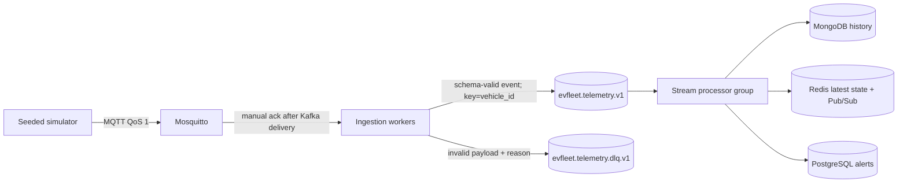

# Telemetry Streaming Path

## Event route



## Topics and order

`evfleet.telemetry.v1` has six partitions and seven-day retention in local Compose; records use `vehicle_id` as the key, so one vehicle maps to one partition and its broker arrival order is preserved within that partition. `evfleet.telemetry.dlq.v1` has three partitions and fourteen-day retention. Both topics are created on ingestion startup with replication factor one in the local single-broker setup.

The event schema is JSON v1 and is checked with Pydantic at ingestion. Breaking changes require a new schema version/topic. Invalid payloads are sent to the DLQ with a truncated validation reason and raw payload. Synthetic test events may contain only synthetic values.

## Delivery and retries

- Simulator publishes MQTT QoS 1.
- Ingestion uses a bounded in-memory work queue and Paho manual acknowledgement. A packet is acknowledged only after Kafka reports delivery for a valid topic or the DLQ topic.
- Kafka producer enables idempotence and `acks=all`; Kafka delivery errors leave the MQTT packet unacknowledged. The bounded queue and Kafka producer buffer apply back-pressure.
- Stream processor disables auto-commit and commits an offset after storage and derived processing finish. A processing failure seeks to the same offset and retries.
- End-to-end delivery is **at least once**, not exactly once. MongoDB’s unique `event_id`, Redis’s monotonic sequence update, and PostgreSQL’s alert `dedupe_key` make retries safe for their respective effects. Redis Pub/Sub notifications may repeat; consumers should use the stable event ID.
- PostgreSQL, MongoDB, and Redis do not share a distributed transaction. On partial failure, the Kafka record is replayed; writes are designed to be idempotent. Full transactional outbox and cross-store reconciliation remain future hardening work.

## Current processing behavior

Each accepted event is appended to MongoDB history, updates the Redis latest-state hash only if its per-vehicle sequence advances, derives a battery category and charging-needed flag, writes any threshold alerts to PostgreSQL, publishes a Redis live-update message, and then commits its Kafka offset. Older sequence numbers are stored in history but cannot overwrite current state or create new alerts. Equal-sequence replays do not advance cache state; the alert unique key suppresses duplicate alert inserts.

The current rules flag SoC ≤20%, range ≤35 km, SoH <80% or selected battery DTCs, and battery temperature ≥50°C. These thresholds are initial transparent rules, not a trained predictive model.

## Local checks

```sh
docker compose logs -f simulator ingestion stream-processor
docker compose exec -T kafka /opt/kafka/bin/kafka-topics.sh --bootstrap-server localhost:9092 --describe --topic evfleet.telemetry.v1
docker compose exec -T mongodb sh -lc 'mongosh --quiet --username "$MONGO_INITDB_ROOT_USERNAME" --password "$MONGO_INITDB_ROOT_PASSWORD" --authenticationDatabase admin evfleet --eval "db.telemetry.countDocuments({})"'
docker compose exec -T redis redis-cli HGET vehicle:latest:EV-000001 payload
docker compose exec -T postgres psql -U evfleet -d evfleet -c 'SELECT alert_type, count(*) FROM alerts GROUP BY alert_type;'
```

## Limits of the local topology

Local Kafka is one broker with replication factor one, and the local MQTT broker allows anonymous access. This demonstrates the event flow and recovery-friendly code paths; it does not satisfy HA, mTLS, or the 100K events/sec target. End-to-end throughput, consumer lag under load, and alert/dashboard latency remain **Not yet measured**.
