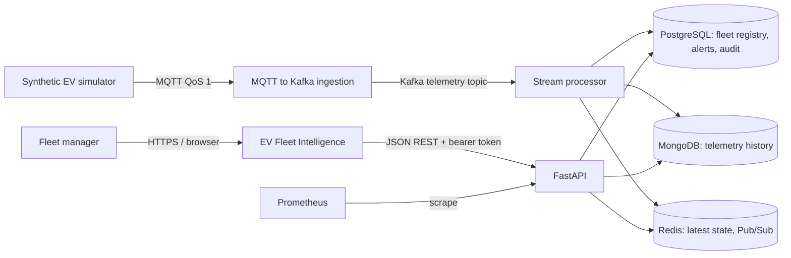
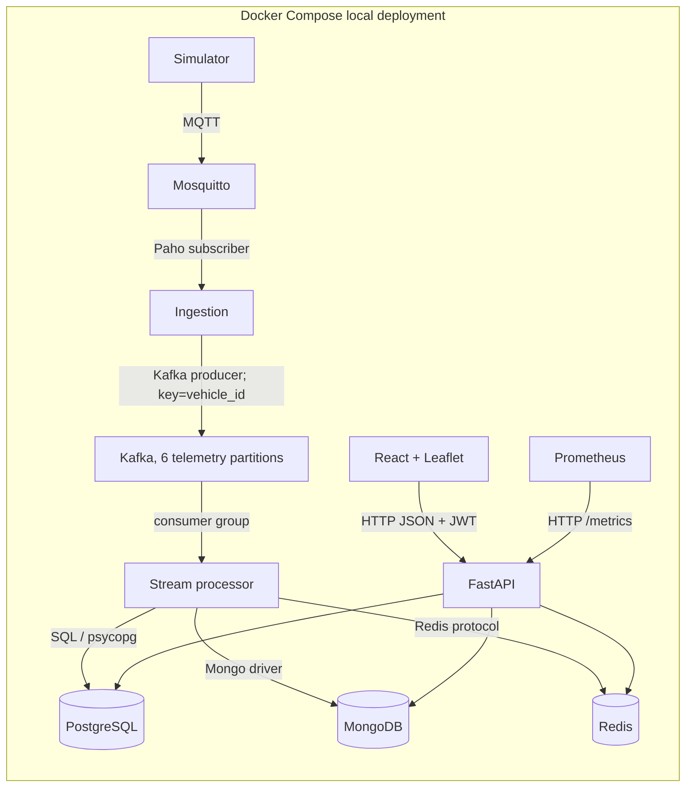
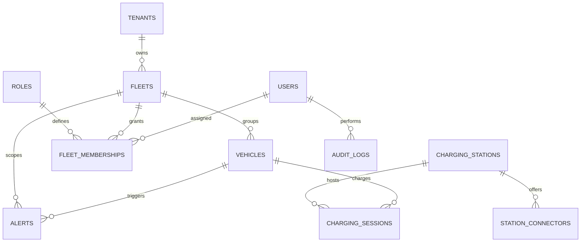
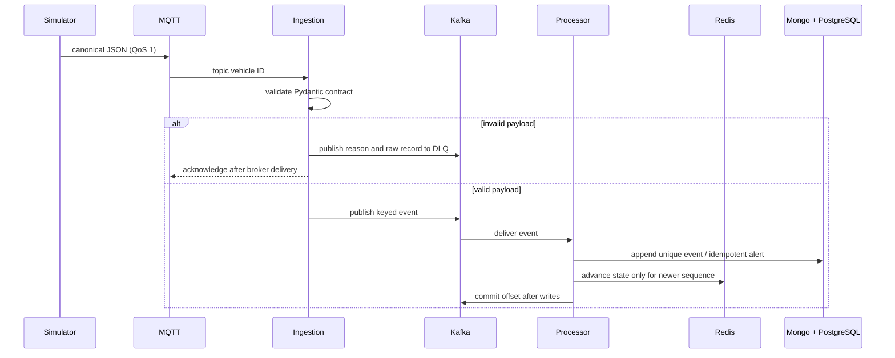
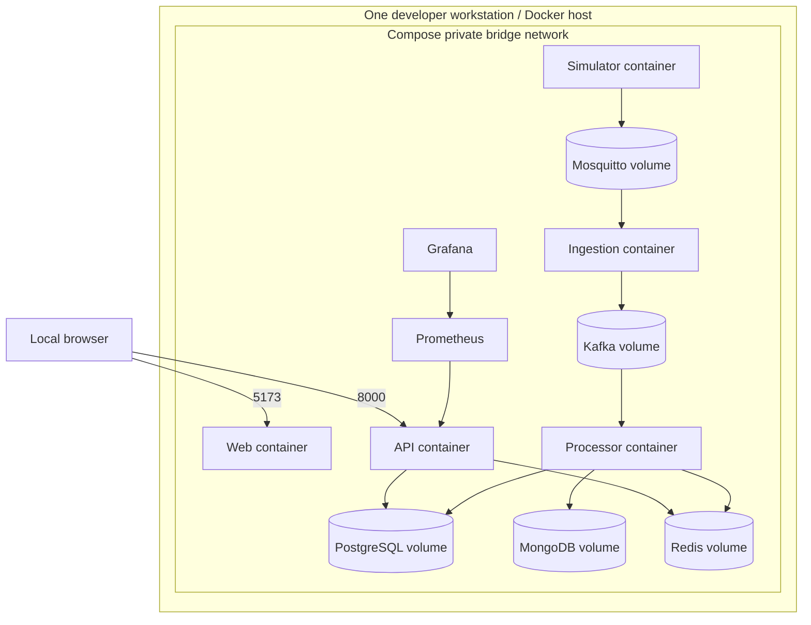
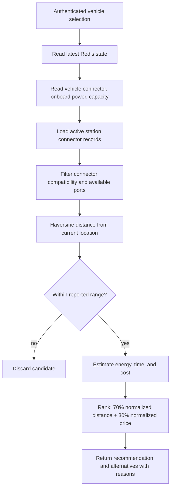
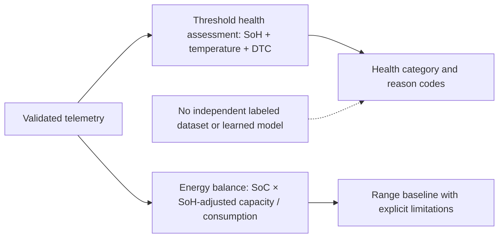

# Architecture diagrams

## C4 Level 1: context



## C4 Level 2: containers and protocols



## Relational model (3NF core)



## Telemetry flow



## Failure/recovery flow

```mermaid
sequenceDiagram
  participant I as Ingestion
  participant K as Kafka
  participant M as MQTT broker
  I->>K: produce event
  K--xI: broker unavailable
  Note over I: bounded queue fills; no MQTT acknowledgement yet
  I->>I: pause intake / retry producer
  K->>I: broker recovers
  I->>K: queued event delivered
  I-->>M: acknowledge QoS 1 message
```

## Deployment view



This local deployment has one host, one instance per service, development credentials, no device identity, no TLS/mTLS, and no autoscaling. Production replicas, managed services, network policies, secrets, and zone placement remain a deployment design task.

## Charging recommendation flow



## Battery and range baseline flow (no trained ML model)



The Compose profile is a single-node development deployment. It does not provide the multi-zone replicas or failure-domain protections of production. End-to-end hop latency has not been measured.
